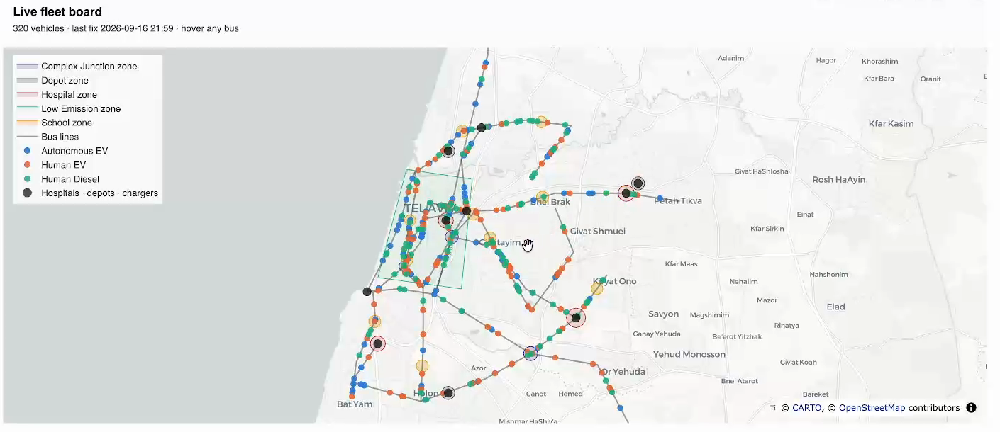
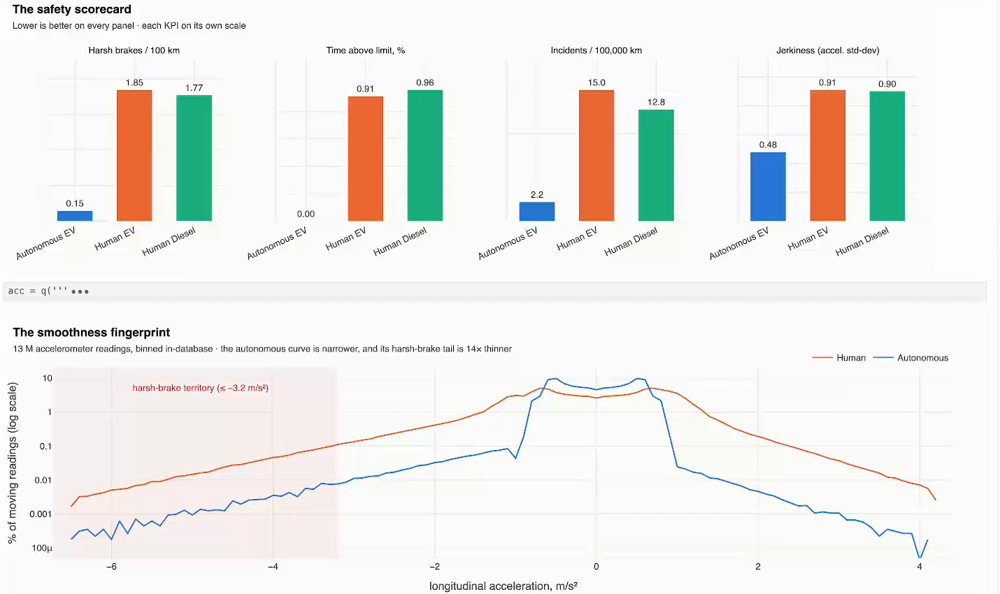
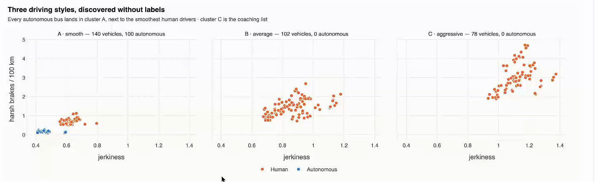
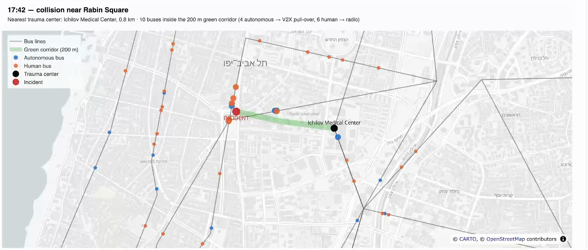
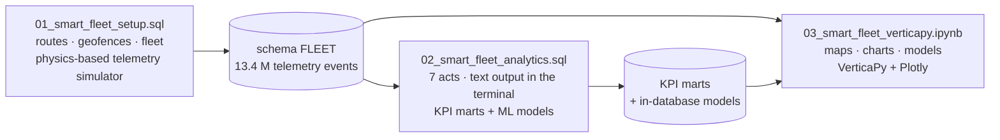

# Smart Fleet on Vertica — autonomous vs. human-driven buses

**IoT, time series, geospatial analytics and machine learning — in one database, in plain SQL.**

A self-contained smart-city demo that simulates a city bus fleet *inside* Vertica and then answers one question with it:
**what is an autonomous bus really worth — in safety, energy and uptime — compared with a human-driven one?**

▶ **Watch the 4-minute film:** https://www.youtube.com/watch?v=VIDEO_ID

| | |
|---|---|
| **Fleet** | 320 buses on 12 lines around Tel Aviv — 100 autonomous (L4) e-buses, 120 human-driven e-buses, 100 human-driven diesel |
| **Data** | one telemetry event per bus per minute → **13.4 million events over 45 days**, generated by a single SQL statement in under 2 minutes |
| **Design** | every line runs the same vehicle mix on the same timetable in the same weather, so the comparison is like for like |
| **Stack** | Vertica (SQL, geospatial, in-database ML) · VerticaPy + Plotly for the visual notebook · nothing else |

No Kafka, no Spark, no external ML service, no data export: the events are created, geofenced, scored, clustered
and modeled where they live.

---

## What you will see

| Result | How it is computed |
|---|---|
| 13.4 M GPS points checked against 21 geofences in **≈ 1.5 s** | `STV_Create_Index` + `STV_Intersect` |
| School zones: autonomous buses **0 %** of readings over the limit, human drivers **≈ 20 %** | point-in-polygon join + aggregation |
| Harsh-braking **black spots** and a bus **907 m off its route** | `ST_GeoHash` binning · `ST_Distance` on the spheroid · `CONDITIONAL_TRUE_EVENT` sessionization |
| Human drivers brake harshly **12×** more often, **6–7×** more collisions per 100,000 km | KPI mart with window functions |
| Close calls: *"speeding, then a harsh brake"* | `MATCH` clause event-pattern matching |
| Same airport line: autonomous bus ends the day at **34 %** battery, the least smooth human driver at **8 %** | `TIMESERIES` gap filling and interpolation |
| Energy cost per 100 km: **$13.6** (autonomous e-bus) vs **$85.5** (diesel) | energy integrated over the real time between messages |
| Clustering puts **all 100** autonomous buses in the smoothest group — without being told which they are | `NORMALIZE_FIT` + `KMEANS` |
| **8 of 8** buses flagged for maintenance were days from failure (AUC ≈ 0.93, hold-out by vehicle) | `RF_CLASSIFIER`, `ROC`, `RF_PREDICTOR_IMPORTANCE` |
| Unknown-unknowns and an explainable energy model | `IFOREST` · `LINEAR_REG` |
| Collision response: nearest trauma center, units on scene, green corridor, lines to divert | `ST_Distance` · `STV_DWithin` · `ST_Intersects` / `ST_Intersection` |
| Bottom line for this fleet: **≈ $16.3 M per year** and **≈ 7,780 t CO₂** avoided | one executive KPI table |

> All figures come from **synthetic data** (see [Honest notes](#honest-notes)). The method is real; the numbers are illustrative.

## Who it is for

The same stream of events answers different questions for different people:

| Audience | What they get |
|---|---|
| **Smart-city municipality** | school-zone compliance, harsh-braking black spots, low-emission-zone exposure, junctions to fix first |
| **Transport / fleet operator** | live fleet board, driver scoring and coaching list, energy per driver and per vehicle type, predictive-maintenance work orders |
| **Vehicle (EV / AV) manufacturer** | where the self-driving stack hands back control, component wear signatures, consumption vs. temperature and driving style |
| **Law enforcement** | speeding in regulated zones, route violations, the event pattern that precedes an incident |
| **Emergency services** | nearest trauma center, vehicles already on scene, a green corridor cleared by V2X |

---

## A look at the notebook

Live fleet board — the latest position of all 320 buses, geofences and facilities (one Top-K query):



The safety scorecard and the "smoothness fingerprint" of 13 million accelerometer readings, binned in-database:



K-means finds three driving styles — and puts every autonomous bus in the smoothest one, unaided:



Emergency response — nearest trauma center and the buses inside the ambulance's green corridor:



---

## How it fits together



Run the three parts in order. Part 3 needs parts 1 **and** 2 (part 2 builds the KPI marts the notebook charts).

## Repository contents

| File | What it is | Runtime* |
|---|---|---|
| `01_smart_fleet_setup.sql` | vsql script — schema `FLEET`; routes and geofences as `GEOMETRY` / `GEOGRAPHY`; vehicles; weather; the telemetry simulator; incident and workshop logs | ~2 min |
| `02_smart_fleet_analytics.sql` | vsql script — the 7-act demo with formatted terminal output (bars, scorecards, alerts) | ~45 s |
| `03_smart_fleet_verticapy.ipynb` | VerticaPy notebook — interactive maps, charts and models | ~1.5 min |
| `sample_output_01_setup.txt`, `sample_output_02_analytics.txt` | genuine terminal output of parts 1 and 2 from a verified run — read them to see the demo without a database | — |
| `screenshot_*.png` | screenshots of the notebook used on this page | — |
| `run_demo.py` | a small `vsql -f` look-alike in Python, for machines without a vsql client | — |
| `setup_venv.sh` | one-time: creates the Python environment `~/.venvs/smart-fleet-demo` and installs everything | ~1–3 min |
| `start_jupyter.sh` | activates the environment, checks the database, opens the notebook in JupyterLab | — |
| `requirements.txt` | Python packages for the notebook and `run_demo.py` | — |
| `bus_demo.sql` | the original, much simpler bus-events script this demo grew out of (kept for reference) | — |

\* measured on a single-node Vertica 26.2 virtual machine with 8 cores and 16 GB RAM.

> The notebook's charts are interactive Plotly figures. GitHub's notebook preview does not run JavaScript, so
> they appear empty there — see the [screenshots](#a-look-at-the-notebook) and the film, or run the notebook.

---

## Quick start

### Requirements

* A Vertica database you may create a schema in (developed and tested on **Vertica 26.2**; the demo uses standard
  geospatial and in-database ML functions). A single small node is enough.
* For parts 1–2: the `vsql` client (ships with Vertica and with the Vertica client package), **or** Python with
  `run_demo.py`.
* For part 3: Python 3.9+ with access to PyPI.
* A UTF-8 terminal at least **160 columns** wide (the widest result table is 158; the `█` bars need UTF-8).

### 1 · Get the files

```bash
git clone https://github.com/<your-user>/vertica-smart-city-demo.git
cd vertica-smart-city-demo
```

### 2 · Build the data and run the analytics (parts 1 and 2)

On the Vertica host:

```bash
/opt/vertica/bin/vsql -f 01_smart_fleet_setup.sql
/opt/vertica/bin/vsql -f 02_smart_fleet_analytics.sql
```

From another machine, with the vsql client:

```bash
vsql -h <host> -p 5433 -U <user> -d <database> -w '<password>' -f 01_smart_fleet_setup.sql
vsql -h <host> -p 5433 -U <user> -d <database> -w '<password>' -f 02_smart_fleet_analytics.sql
```

No vsql client? After step 3 the Python environment can run both scripts:

```bash
python run_demo.py --host <host> --user <user> --password '<password>' --database <database> \
       01_smart_fleet_setup.sql 02_smart_fleet_analytics.sql
```

**Presenter mode** — pause before every act and continue with ENTER:

```bash
DEMO_PAUSE=1 vsql -f 02_smart_fleet_analytics.sql
```

### 3 · Open the notebook (part 3)

```bash
./setup_venv.sh        # once: creates ~/.venvs/smart-fleet-demo, installs VerticaPy + JupyterLab
./start_jupyter.sh     # every time: checks the database, opens the notebook
```

In JupyterLab choose **Run → Run All Cells** (about 1.5 minutes). Stop Jupyter with Ctrl-C twice.

**Connection settings** are read from environment variables (defaults in brackets):

```bash
export VERTICA_HOST=127.0.0.1      # [127.0.0.1]
export VERTICA_PORT=5433           # [5433]
export VERTICA_DB=VDB              # [VDB]
export VERTICA_USER=dbadmin        # [dbadmin]
export VERTICA_PASSWORD=''         # [empty]
```

Other options: `PORT=8890 ./start_jupyter.sh` (another Jupyter port) · `VENV_DIR=/path ./setup_venv.sh` ·
`PYTHON=python3.11 ./setup_venv.sh`.

<details>
<summary><b>Database on a remote server or VM? Use ssh tunnels</b></summary>

```bash
# database port: run this on your laptop, then use host 127.0.0.1 everywhere
ssh -L 5433:127.0.0.1:5433 <user>@<server>

# Jupyter running on the server, browser on your laptop
ssh -L 8888:127.0.0.1:8888 <user>@<server>
# then paste the printed  http://127.0.0.1:8888/lab?token=...  link into your browser
```

When `start_jupyter.sh` detects an ssh session it starts Jupyter without a browser and prints these steps.
</details>

<details>
<summary><b>Doing it by hand instead of the helper scripts</b></summary>

```bash
python3 -m venv ~/.venvs/smart-fleet-demo
source ~/.venvs/smart-fleet-demo/bin/activate
pip install -r requirements.txt
jupyter lab 03_smart_fleet_verticapy.ipynb      # on a server add: --no-browser --ip=127.0.0.1 --port=8888
```
</details>

<details>
<summary><b>Sharing the results without a database: export the notebook to HTML</b></summary>

```bash
# with code - for technical audiences
jupyter nbconvert --to html --execute 03_smart_fleet_verticapy.ipynb --output smart_fleet.html
# code hidden - for business audiences
jupyter nbconvert --to html --execute --no-input 03_smart_fleet_verticapy.ipynb --output smart_fleet_presentation.html
```

The exported page is interactive; it loads the Plotly library from its CDN, so the viewer needs internet access.
</details>

### 4 · Clean up

```sql
DROP SCHEMA FLEET CASCADE;   -- removes every table, view and model of this demo
```

---

## The story, act by act (part 2)

| Act | For whom | Vertica capability on show |
|---|---|---|
| **1 · The IoT stream** | operator | Top-K `LIMIT 1 OVER (PARTITION BY …)` live fleet board; `TIMESERIES` gap filling with linear interpolation through a GPS dead zone |
| **2 · Where it happens** | city, operator, AV maker | `STV_Create_Index` + `STV_Intersect` (13.4 M GPS fixes × 21 polygons in ≈ 1.5 s); school-zone compliance; low-emission-zone exhaust; route adherence (planar pre-filter → spheroid `ST_Distance`, sessionized with `CONDITIONAL_TRUE_EVENT`); `ST_GeoHash` black spots; AV disengagement hot spots |
| **3 · Autonomous vs. human** | operator, AV maker | KPI mart with window functions; safety scorecard per 100 km; driver coaching list; rain penalty; `MATCH` clause pattern search ("speeding, then harsh brake") |
| **4 · Energy** | operator, EV maker, city | kWh/km, regeneration share, consumption vs. temperature (`WIDTH_BUCKET`), charging cycles from the state-of-charge signal, diesel idling cost and CO₂ |
| **5 · Machine learning** | operator, EV/AV maker | `KMEANS` driving styles; `RF_CLASSIFIER` predictive maintenance with an honest hold-out by vehicle; `ROC`; `RF_PREDICTOR_IMPORTANCE`; work orders with nearest depot; `IFOREST` anomalies; `LINEAR_REG` explaining energy use |
| **6 · Emergency response** | dispatch, city | nearest trauma center, units on scene (`STV_DWithin`), green corridor, lines to divert (`ST_Intersects` / `ST_Intersection`) |
| **7 · Executive summary** | everyone | one KPI table and the annualized value |

## Data model (schema `FLEET`)

| Table | Content |
|---|---|
| `routes`, `route_posts`, `route_points` | 12 bus lines as WKT `LINESTRING`s, densified to one post per 50 m |
| `zones` | 21 geofences — school, hospital quiet zone, low-emission zone, complex junction, depot |
| `facilities` | hospitals, depots and charging hubs as `GEOGRAPHY` points |
| `vehicles` | 320 vehicles — segment, drive mode, powertrain, model, battery / tank size, driver or AV stack, line, depot |
| `weather_hourly` | temperature and rain per hour (drives HVAC load and the rain penalty) |
| `telemetry` | **the IoT stream** — position, speed, acceleration, power, energy, temperatures, vibration, tire pressure, passengers, flags |
| `incidents`, `maintenance_log` | operational systems of record — safety incidents and workshop visits |
| `sim_*` | simulator internals: driver profiles, the hidden failure plan, benign vibration episodes |
| *built by part 2* | `zone_hits`, `vehicle_day`, `segment_scorecard`, `vehicle_score`, `vehicle_style`, `pdm_*`, `exec_kpi`, and the models `fleet_style_kmeans`, `fleet_pdm_rf`, `fleet_iforest`, `fleet_energy_lr` |

Columnar storage compresses the telemetry about **4.6 : 1** against the same events written as CSV
(342 MB vs 1,564 MB) — part 1 measures and prints the figure for your own load.

## Scaling it up or down

The knobs are at the top of `01_smart_fleet_setup.sql`:

```sql
\set DEMO_DAYS   45      -- days of history       (keep >= 30 so the maintenance model has breakdowns to learn from)
\set FLEET_SIZE  320     -- number of vehicles
\set SAMPLE_SEC  60      -- seconds between telemetry events
```

Rows ≈ `FLEET_SIZE × DEMO_DAYS × 16 h × 3600 / SAMPLE_SEC`. The defaults give 13.4 million.

---

## Honest notes

* **All data is synthetic.** The simulator has real structure — stop-to-stop kinematics, a traction and
  regeneration energy model, HVAC load from weather, wear signatures that build up for 10 days before a
  breakdown, sudden electrical faults with *no* precursor, benign vibration episodes that look like faults, lost
  messages — so the models have to work for their results (predictive maintenance reaches AUC ≈ 0.93, not 1.0).
* **The autonomous advantage is an assumption of the simulator** (smooth control, speed-limit compliance), not a
  finding. The demo shows *how* to measure it on real data, not what the answer will be.
* **Randomness:** telemetry uses `RANDOM()`, so figures move a little between loads. The plot — which vehicles
  fail, who detours, where the black spots are — is hash-seeded and stays the same.
* **Money:** dollar figures use list-price assumptions that are printed next to every result. Change them freely.
* **Geography:** routes are straight segments between real landmarks — schematic, not the real street network.
  Notebook maps use OpenStreetMap-based tiles (© OpenStreetMap contributors, © CARTO).
* **Verification:** both SQL scripts ran end to end through the `vsql` client against Vertica 26.2 with no errors
  or warnings. The only stderr lines are harmless `NOTICE: Nothing was dropped` answers to the
  `DROP … IF EXISTS` housekeeping at the top of part 2, on the first run only. The notebook executes with no cell
  errors.

## Troubleshooting

| Symptom | Fix |
|---|---|
| Tables wrap or look broken in the terminal | widen the terminal to 160+ columns; use a UTF-8 locale |
| `start_jupyter.sh` says the database is unreachable | check `VERTICA_HOST` / `VERTICA_PORT`, or open the ssh tunnel first |
| The notebook stops at a missing table | run part 2 — it builds the KPI marts and models the notebook reads |
| Charts are empty in GitHub's notebook preview | expected (GitHub does not run JavaScript) — run the notebook, or see the screenshots above |
| `setup_venv.sh` cannot find a suitable Python | install Python 3.9+ or point to one: `PYTHON=python3.11 ./setup_venv.sh` |

## License

Released under the [MIT License](LICENSE).

## Disclaimer

This repository is a **demonstration only**. It is provided **"as is", without warranty of any kind**, and is not
intended for production use. All data is simulated and every figure is illustrative. The author accepts **no
responsibility or liability** for any use of this material or for any consequence of using it. This is a personal
project, not an official product, documentation or statement of any company; Vertica and all other product names
are trademarks of their respective owners.
